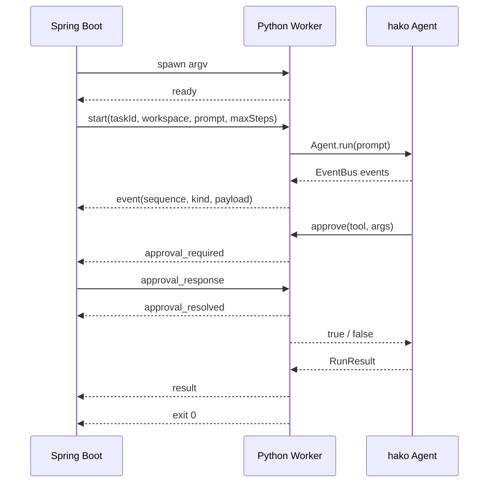

# hako Web 控制台 API 与 Worker 协议

> 文档版本：1.0｜日期：2026-08-28｜状态：REST/SSE、Spring Boot 状态机、真实/假 Worker 与前端 API Client 已实现
>
> 需求范围见 [`WEB_CONSOLE_REQUIREMENTS.md`](./WEB_CONSOLE_REQUIREMENTS.md)。本文同时定义浏览器与 Spring Boot 之间的 REST/SSE 接口，以及 Spring Boot 与 Python Worker 之间的 JSONL 协议。

## 1. 协议边界

```text
Vue 浏览器  ── REST + SSE ──>  Spring Boot  ── JSONL + Process ──>  Python Worker  ──>  hako Agent
```

- REST 表达用户意图：创建、查询、审批、取消和读取摘要。
- SSE 传输服务端到浏览器的有序实时事件；浏览器不通过 SSE 发命令。
- JSONL 是本机进程协议，不对网络开放；stdout 只能输出协议行，stderr 只能输出诊断。
- Python Worker 只适配 `EventBus`、审批回调与 `RunResult`，不复制 Agent 决策。
- 模型密钥不属于任何接口字段，只由 Python `Config.from_env()` 读取。

## 2. 公共约定

### 2.1 HTTP 基础信息

开发环境默认地址为 `http://127.0.0.1:8080`，REST 前缀为 `/api/v1`。请求与响应统一使用 UTF-8 JSON；SSE 使用 `text/event-stream; charset=UTF-8`。生产形态建议由 Spring Boot 同源托管前端，开发态仅对显式配置的本机 Vite 地址开放 CORS。

### 2.2 字段约定

| 字段 | 约定 |
|---|---|
| `schemaVersion` | REST/SSE 当前为字符串 `1.0`；JSONL 使用 `protocolVersion: 1.0`。 |
| `taskId` / `approvalId` | UUID v4 字符串，由服务端或 Worker 生成，客户端不得自定。 |
| 时间 | RFC 3339 UTC，例如 `2026-08-28T03:21:45.123Z`。 |
| 枚举 | JSON 中使用大写蛇形任务状态，使用现有小写 `StopReason` 值。未知枚举不得猜测。 |
| 文件路径 | 创建任务时 `workspace` 是绝对路径；Agent 变更路径统一为 workspace 相对 POSIX 风格，不返回密钥。 |
| 空值 | 尚未产生的数据使用 `null`，空集合使用 `[]`，不以空字符串代替对象。 |
| 数值 | token、步数、耗时和事件序号均为非负整数；`step` 从 1 开始。 |

### 2.3 任务状态与停止原因

任务状态：`CREATED`、`STARTING`、`RUNNING`、`WAITING_APPROVAL`、`CANCELLING`、`COMPLETED`、`FAILED`、`CANCELLED`。前三者和等待/取消是运行态，后三者是终态。

Agent 停止原因沿用 `hako.loop.StopReason`：

| `stopReason` | Web 状态 | `success` | 含义 |
|---|---|---:|---|
| `done_read_only` | `COMPLETED` | true | 没有文件变化的只读任务正常完成。 |
| `done_verified` | `COMPLETED` | true | 发生修改，且最后一次修改之后存在成功验证。 |
| `done_unverified` | `FAILED` | false | 修改后仍未留下成功验证。 |
| `incomplete` | `FAILED` | false | 模型连续截断等原因导致未完成。 |
| `max_steps` | `FAILED` | false | 达到最大步数。 |
| `stuck` | `FAILED` | false | 同参数工具调用达到重复阈值。 |
| `denied` | `FAILED` | false | 用户拒绝副作用操作。 |
| `error` | `FAILED` | false | Agent 内部或模型请求出现不可恢复错误。 |

Worker 启动失败、协议错误或进程崩溃同样得到 `FAILED`，但此时 `stopReason` 为 `null`，由结构化 `error` 说明基础设施原因。

## 3. 资源模型

### 3.1 Task

```json
{
  "schemaVersion": "1.0",
  "taskId": "b7199fd2-1972-45a0-ad1e-46fde5e2341d",
  "status": "RUNNING",
  "workspace": "D:\\work\\router-demo",
  "prompt": "复现失败并做最小修复，补充回归测试后运行完整测试。",
  "options": {
    "maxSteps": 40
  },
  "createdAt": "2026-08-28T03:20:00.000Z",
  "startedAt": "2026-08-28T03:20:00.412Z",
  "finishedAt": null,
  "progress": {
    "step": 3,
    "maxSteps": 40,
    "usedTokens": 12400,
    "contextLimit": 1000000,
    "messageCount": 9
  },
  "pendingApproval": null,
  "outcome": null,
  "error": null,
  "links": {
    "self": "/api/v1/tasks/b7199fd2-1972-45a0-ad1e-46fde5e2341d",
    "events": "/api/v1/tasks/b7199fd2-1972-45a0-ad1e-46fde5e2341d/events",
    "summary": "/api/v1/tasks/b7199fd2-1972-45a0-ad1e-46fde5e2341d/summary"
  }
}
```

`progress` 在尚未收到对应事件时字段可为 `null`。`pendingApproval` 只在 `WAITING_APPROVAL` 时为 Approval 对象。`outcome` 只在收到完整 Worker result 后出现；`error` 只描述基础设施或协议故障，不承载普通工具失败。

### 3.2 Approval

```json
{
  "approvalId": "5645d984-0dda-419f-8612-bb3caf502aef",
  "taskId": "b7199fd2-1972-45a0-ad1e-46fde5e2341d",
  "status": "PENDING",
  "tool": {
    "name": "edit_file",
    "args": {
      "path": "router/headers.py",
      "old_text": "raw = headers.get(name)",
      "new_text": "raw = get_header_case_insensitive(headers, name)"
    }
  },
  "riskLevel": "NORMAL",
  "dangerReason": null,
  "allowedDecisions": ["ALLOW_ONCE", "ALLOW_SESSION", "DENY"],
  "requestedAt": "2026-08-28T03:20:08.830Z",
  "resolvedAt": null,
  "decision": null
}
```

`riskLevel` 取 `NORMAL` 或 `HIGH`。`HIGH` 的 `allowedDecisions` 必须只有 `ALLOW_ONCE` 与 `DENY`。工具参数可能包含源码或命令，后端不得写入普通访问日志。

### 3.3 Outcome / Summary

```json
{
  "schemaVersion": "1.0",
  "taskId": "b7199fd2-1972-45a0-ad1e-46fde5e2341d",
  "status": "COMPLETED",
  "success": true,
  "stopReason": "done_verified",
  "steps": 8,
  "totalTokens": 23140,
  "finalText": "已统一 Header 查找并补充大小写混合输入的回归测试。",
  "changedPaths": [
    "router/headers.py",
    "tests/test_headers.py"
  ],
  "verification": [
    {
      "kind": "test",
      "command": "C:\\path\\to\\python.exe -m pytest -q",
      "summary": "18 passed in 0.42s",
      "step": 7
    }
  ],
  "error": null,
  "finishedAt": "2026-08-28T03:20:20.141Z"
}
```

`verification` 必须来自 `RunResult.verification`，不能从 `finalText`、终端颜色或字符串中猜测。修改后再次写入会清空旧证据，因此数组只代表最终版本仍有效的验证。

## 4. REST API

### 4.1 创建任务

`POST /api/v1/tasks`

请求：

```json
{
  "workspace": "D:\\work\\router-demo",
  "prompt": "复现失败并做最小修复，补充回归测试后运行完整测试。",
  "options": {
    "maxSteps": 40
  }
}
```

规则：

- `workspace` 必须是绝对、存在、可读的目录；后端调用 `toRealPath()` 后按路径组件判断其位于配置的允许根目录内。
- `prompt.trim()` 长度为 1–20,000；REST 请求体上限 64 KiB。
- `options` 可省略；`maxSteps` 默认 40，范围 1–100；未知字段返回 `400`，不静默忽略。
- 模型、Base URL、API Key、是否启用 subagent 不允许从浏览器覆盖。
- 同一服务已有 STARTING、RUNNING、WAITING_APPROVAL 或 CANCELLING 任务时返回 `409 TASK_CONFLICT`。

成功响应：`202 Accepted`，响应体为 Task；正常情况下状态为 `STARTING`。响应成功只表示任务已登记并开始启动，不表示 Agent 已完成。

### 4.2 查询任务

`GET /api/v1/tasks/{taskId}`

成功响应：`200 OK`，响应体为完整 Task。不存在返回 `404 TASK_NOT_FOUND`。前端首次打开或刷新时先调用此接口；若存在 `pendingApproval`，应恢复审批界面。

### 4.3 订阅事件

`GET /api/v1/tasks/{taskId}/events`

请求头：

```http
Accept: text/event-stream
Last-Event-ID: 17
```

`Last-Event-ID` 可省略；省略时从当前内存缓冲区最早事件开始重放，提供时只重放 ID 更大的事件。浏览器原生 EventSource 会在短暂断线重连时自动携带该头；完整页面刷新没有旧连接状态，应先 GET Task，再省略该头重建当前缓冲区。成功返回 `200 OK` 与 SSE 流；任务不存在返回 JSON 格式的 `404`。终态任务完成重放后服务端关闭连接；浏览器断开不取消任务。

响应头至少包含：

```http
Content-Type: text/event-stream; charset=UTF-8
Cache-Control: no-cache, no-transform
Connection: keep-alive
X-Accel-Buffering: no
```

### 4.4 响应审批

`POST /api/v1/tasks/{taskId}/approvals/{approvalId}`

请求：

```json
{
  "decision": "ALLOW_ONCE"
}
```

`decision` 取 `ALLOW_ONCE`、`ALLOW_SESSION` 或 `DENY`。服务端必须以任务、未决审批 ID、允许决策集合和当前状态四项共同校验，不能只凭 ID 放行。成功写入 Worker 后返回 `202 Accepted`：

```json
{
  "schemaVersion": "1.0",
  "taskId": "b7199fd2-1972-45a0-ad1e-46fde5e2341d",
  "approvalId": "5645d984-0dda-419f-8612-bb3caf502aef",
  "status": "ACCEPTED",
  "decision": "ALLOW_ONCE",
  "acceptedAt": "2026-08-28T03:20:10.012Z"
}
```

`ACCEPTED` 只表示决定已经写入 Worker stdin；权威处理结果随后由 `approval_resolved` SSE 事件确认。HTTP 响应不提前把审批标成已执行。

审批已处理、不是当前任务审批、任务已结束或高风险请求使用 `ALLOW_SESSION` 均返回 `409`。拒绝后 Agent 会很快以 `denied` 结束；在 result 到达前，HTTP 响应不能提前声称任务已经 FAILED。

### 4.5 取消任务

`POST /api/v1/tasks/{taskId}/cancel`

请求无正文。STARTING、RUNNING 或 WAITING_APPROVAL 时返回 `202 Accepted`：

```json
{
  "schemaVersion": "1.0",
  "taskId": "b7199fd2-1972-45a0-ad1e-46fde5e2341d",
  "status": "CANCELLING",
  "message": "正在终止 Worker 进程树；已发生的文件修改不会自动回滚。"
}
```

重复取消 CANCELLING 返回相同 `202`；已是 CANCELLED 返回 `200`；其他终态返回 `409 INVALID_STATE`。后端先终止 Worker，5 秒后仍存活则强制结束其进程树，最终发布 `task_cancelled` 并置为 CANCELLED。

### 4.6 获取最终摘要

`GET /api/v1/tasks/{taskId}/summary`

任务终态且存在结果时返回 `200 OK` 与 Outcome/Summary。活动任务返回 `409 TASK_NOT_FINISHED`；Worker 在返回 `RunResult` 前崩溃时仍返回 `200`，其中 `success=false`、`stopReason=null`、`verification=[]`、`error` 为结构化故障。

### 4.7 健康检查

`GET /api/v1/health`

```json
{
  "schemaVersion": "1.0",
  "status": "UP",
  "version": "0.1.0",
  "worker": {
    "pythonConfigured": true,
    "entrypointReadable": true
  }
}
```

健康检查不启动 Agent、不调用 LLM、不读取或返回密钥。后端可响应时返回 `200`；`worker.pythonConfigured` 与 `worker.entrypointReadable` 分别暴露 Worker 配置检查，不能把它们误读成模型服务已经可用。

## 5. HTTP 错误格式

除已建立的 SSE 流外，所有 HTTP 错误统一返回：

```json
{
  "schemaVersion": "1.0",
  "error": {
    "code": "WORKSPACE_OUTSIDE_ALLOWED_ROOTS",
    "message": "workspace 不在允许的本地根目录内。",
    "requestId": "4c610d95-32f5-4b17-a292-4331069d571c",
    "details": {
      "field": "workspace"
    }
  }
}
```

| HTTP | `code` | 场景 |
|---:|---|---|
| 400 | `INVALID_REQUEST` | JSON 非法、未知字段、长度或类型错误。 |
| 403 | `WORKSPACE_OUTSIDE_ALLOWED_ROOTS` | 路径解析后越出允许根目录。 |
| 404 | `TASK_NOT_FOUND` / `APPROVAL_NOT_FOUND` | 资源不存在。 |
| 409 | `TASK_CONFLICT` | 已有活动任务。 |
| 409 | `INVALID_STATE` | 当前状态不允许该操作。 |
| 409 | `APPROVAL_ALREADY_RESOLVED` / `DECISION_NOT_ALLOWED` | 审批重复或决策越权。 |
| 409 | `TASK_NOT_FINISHED` | 任务仍在运行，摘要尚不可用。 |
| 413 | `PAYLOAD_TOO_LARGE` | HTTP 请求超过 64 KiB。 |
| 500 | `INTERNAL_ERROR` | 未分类后端错误；返回前必须脱敏。 |

Worker 启动、协议和崩溃错误通常发生在创建任务的 `202` 之后，应通过任务状态、SSE 和 Summary 暴露，而不是让原 HTTP 请求长时间等待。

## 6. SSE 事件协议

### 6.1 帧格式

每条业务事件使用相同的 `id`、`event` 和 `data`：

```text
id: 12
event: tool_call_finished
data: {"schemaVersion":"1.0","eventId":12,"taskId":"b7199fd2-1972-45a0-ad1e-46fde5e2341d","type":"tool_call_finished","source":"HAKO","occurredAt":"2026-08-28T03:20:06.411Z","payload":{"callId":"call_7","name":"read_file","ok":true,"summary":"router/headers.py 1-86","detail":"...","durationMs":4}}

```

统一 Envelope：

```json
{
  "schemaVersion": "1.0",
  "eventId": 12,
  "taskId": "b7199fd2-1972-45a0-ad1e-46fde5e2341d",
  "type": "tool_call_finished",
  "source": "HAKO",
  "occurredAt": "2026-08-28T03:20:06.411Z",
  "payload": {}
}
```

`eventId` 由 Spring 在接收顺序上统一分配，在单任务内从 1 单调递增；它与 Worker 的 `sequence` 是两个字段，后者只用于检查进程协议是否丢帧。`source` 取 `HAKO`、`WORKER` 或 `WEB`。每 15 秒无业务事件时发送 SSE 注释 `: heartbeat <timestamp>`，心跳没有 ID，也不写入事件缓存。

### 6.2 现有 hako 事件映射

字段名只做 snake_case 到 camelCase 的机械转换，不改变语义。

| `type` | `payload` 字段 | 来源 |
|---|---|---|
| `run_started` | `task`, `model`, `cwd` | `events.RunStarted` |
| `turn_started` | `step`, `maxSteps` | `events.TurnStarted` |
| `assistant_text` | `text` | `events.AssistantText` |
| `tool_call_started` | `callId`, `name`, `args` | `events.ToolCallStarted` |
| `tool_call_finished` | `callId`, `name`, `ok`, `summary`, `detail`, `durationMs` | `events.ToolCallFinished` |
| `context_stats` | `usedTokens`, `limit`, `messageCount` | `events.ContextStats` |
| `verification_required` | `changedPaths`, `message` | `events.VerificationRequired` |
| `continuation_required` | `attempt`, `maxAttempts`, `finishReason`, `message` | `events.ContinuationRequired` |
| `subagent_started` | `task`, `maxSteps` | `events.SubagentStarted` |
| `subagent_finished` | `ok`, `reason`, `steps`, `totalTokens`, `maxContextTokens` | `events.SubagentFinished` |
| `run_finished` | `reason`, `steps`, `totalTokens`, `changedPaths`, `verification` | `events.RunFinished` |
| `agent_error` | `message`, `fatal` | `events.AgentError` |

注意：当前 `run_finished.verification` 只有最后一条验证摘要；完整 `VerificationEvidence[]` 只在后续 `task_result` 中出现。`tool_call_finished.ok=false` 是可恢复工具错误，不得直接把任务置为 FAILED。

### 6.3 Web/Worker 补充事件

| `type` | `payload` | 作用 |
|---|---|---|
| `task_status` | `previous`, `current`, `reason` | 显式同步任务状态转换。 |
| `approval_required` | 完整 Approval | Worker 审批适配器在调用现有同步回调返回前产生。 |
| `approval_resolved` | `approvalId`, `decision`, `resolvedAt` | 已把合法决策送达对应回调。 |
| `task_result` | 完整 Outcome（不重复外层 `taskId`） | `Agent.run()` 返回后的权威结果，用于摘要。 |
| `worker_error` | `code`, `message`, `exitCode` | Worker 启动失败、协议错误或异常退出；内容已脱敏。 |
| `task_cancelled` | `message`, `forced` | 进程树已结束；`forced` 表示是否超过宽限期。 |
| `stream_gap` | `requestedAfter`, `oldestAvailable`, `reason` | 客户端要求的旧事件已被内存上限淘汰。该传输提示使用 `eventId=0` 且不发送 SSE `id`，不占用任务业务序号。 |

### 6.4 重连与缓存

后端每任务缓存最多 2,000 条或 10 MiB 序列化事件。客户端的 `Last-Event-ID` 早于最早可用 ID 时，先返回不带 SSE `id` 的 `stream_gap`，再从最早可用事件继续；前端必须显示“部分早期详情不可恢复”，不能把时间线装作完整。状态、审批与终态事件相对普通详情优先保留；如果缓存全部由关键事件组成，仍以有界内存为准淘汰最旧项，并通过 `stream_gap` 诚实暴露缺口。任务缓存仅在当前后端进程内有效。

## 7. Spring Boot ↔ Python Worker JSONL 协议

### 7.1 进程启动

Spring 使用配置的 Python 解释器，以 argv 数组启动：

```text
<pythonExecutable> -u web/worker/main.py
```

进程工作目录是 hako 仓库根目录。不得通过 `cmd /c`、PowerShell 字符串或 shell 拼接启动；任务 prompt 和 workspace 只通过 stdin JSON 发送，避免命令注入、Windows 引号和命令长度问题。Worker 继承后端显式允许的环境变量；API Key 由 hako 根目录 `.env` 或 Python 进程环境读取，不在 Spring 对象中传递。

### 7.2 帧规则

- 每个 JSON 对象占一行，以 LF 结束，编码 UTF-8；空行非法。
- 单行上限 1 MiB；超限、非法 UTF-8、非法 JSON、未知顶层 `type` 或版本不兼容均为 `WORKER_PROTOCOL_ERROR`。
- stdout 只允许 JSONL。Rich、traceback、调试输出和第三方日志一律写 stderr。
- stderr 只保留最后 256 KiB 的脱敏诊断，不直接转发为 SSE 工具详情。
- Worker 收到一次 `start` 后不接受第二次；任务结束发送一次 `result` 后正常退出码为 0。
- 所有任务级 Worker 输出都有从 1 开始的连续 `sequence`，Spring 用它检查 Worker 输出重复、跳号或倒序；Spring 另行按所有 HAKO/WORKER/WEB 事件的实际接收顺序分配 SSE `eventId`，二者不得混用。

### 7.3 生命周期



Worker 必须有独立 stdin 读取线程，把 `approval_response` 投递到按 `approvalId` 等待的队列；Agent 仍在主线程顺序运行。任何时候最多存在一个未决审批。JSONL v1 不定义协作式 cancel：Spring 取消时直接按进程生命周期终止 Worker 进程树。

### 7.4 Spring → Worker 消息

#### `start`

```json
{
  "protocolVersion": "1.0",
  "type": "start",
  "requestId": "c9850a5d-b325-45c8-a402-f3af0ec91df4",
  "payload": {
    "taskId": "b7199fd2-1972-45a0-ad1e-46fde5e2341d",
    "workspace": "D:\\work\\router-demo",
    "prompt": "复现失败并做最小修复，补充回归测试后运行完整测试。",
    "maxSteps": 40
  }
}
```

Worker 再次执行真实路径校验并构造 `Config.from_env(workspace=...)`；不能因为 Spring 已校验就跳过 Python 工具边界。

#### `approval_response`

```json
{
  "protocolVersion": "1.0",
  "type": "approval_response",
  "requestId": "23dc3140-2bb7-4be2-bcee-bd3fa8cb7a4b",
  "payload": {
    "taskId": "b7199fd2-1972-45a0-ad1e-46fde5e2341d",
    "approvalId": "5645d984-0dda-419f-8612-bb3caf502aef",
    "decision": "ALLOW_ONCE"
  }
}
```

Worker 也要校验决策；`HIGH + ALLOW_SESSION` 必须拒绝并发送 `fatal` 或保持等待合法响应，不能降级为 ALLOW_ONCE。推荐把非法后端消息视为协议错误并终止，避免安全边界模糊。

### 7.5 Worker → Spring 消息

#### `ready`

```json
{
  "protocolVersion": "1.0",
  "type": "ready",
  "workerPid": 18420,
  "capabilities": ["events", "approval", "run_result"]
}
```

Worker 启动后 10 秒内未发送合法 `ready`，后端以 `WORKER_START_TIMEOUT` 失败并结束进程。

#### `event`

```json
{
  "protocolVersion": "1.0",
  "type": "event",
  "taskId": "b7199fd2-1972-45a0-ad1e-46fde5e2341d",
  "sequence": 4,
  "occurredAt": "2026-08-28T03:20:03.204Z",
  "payload": {
    "kind": "turn_started",
    "data": {
      "step": 2,
      "maxSteps": 40
    }
  }
}
```

序列化器必须显式列出允许的 hako 事件类型；新增 dataclass 若没有协议映射，应在测试中失败，而不是把 `repr()` 发给前端。

#### `approval_required`

```json
{
  "protocolVersion": "1.0",
  "type": "approval_required",
  "taskId": "b7199fd2-1972-45a0-ad1e-46fde5e2341d",
  "sequence": 9,
  "occurredAt": "2026-08-28T03:20:08.830Z",
  "payload": {
    "approvalId": "5645d984-0dda-419f-8612-bb3caf502aef",
    "tool": {
      "name": "edit_file",
      "args": {
        "path": "router/headers.py",
        "old_text": "raw = headers.get(name)",
        "new_text": "raw = get_header_case_insensitive(headers, name)"
      }
    },
    "riskLevel": "NORMAL",
    "dangerReason": null,
    "allowedDecisions": ["ALLOW_ONCE", "ALLOW_SESSION", "DENY"]
  }
}
```

该消息发生在工具执行之前，也早于现有 `tool_call_started`。Spring 收到后原子设置 WAITING_APPROVAL；在合法响应送达前不得再接收新的工具开始事件。

#### `approval_resolved`

```json
{
  "protocolVersion": "1.0",
  "type": "approval_resolved",
  "taskId": "b7199fd2-1972-45a0-ad1e-46fde5e2341d",
  "sequence": 10,
  "occurredAt": "2026-08-28T03:20:10.015Z",
  "payload": {
    "approvalId": "5645d984-0dda-419f-8612-bb3caf502aef",
    "decision": "ALLOW_ONCE"
  }
}
```

发送后审批回调才返回 `True/False`。`ALLOW_SESSION` 只记忆当前 Worker 内的普通工具名；遇到 `danger_reason` 时仍产生新的审批。

#### `result`

```json
{
  "protocolVersion": "1.0",
  "type": "result",
  "taskId": "b7199fd2-1972-45a0-ad1e-46fde5e2341d",
  "sequence": 18,
  "occurredAt": "2026-08-28T03:20:20.141Z",
  "payload": {
    "success": true,
    "stopReason": "done_verified",
    "steps": 8,
    "totalTokens": 23140,
    "finalText": "已统一 Header 查找并补充回归测试。",
    "changedPaths": ["router/headers.py", "tests/test_headers.py"],
    "verification": [
      {
        "kind": "test",
        "command": "C:\\path\\to\\python.exe -m pytest -q",
        "summary": "18 passed in 0.42s",
        "step": 7
      }
    ]
  }
}
```

Spring 校验 result 与此前 `run_finished` 的 reason、steps、totalTokens 和 changedPaths；不一致时任务置为 FAILED，错误码 `WORKER_PROTOCOL_ERROR`。验证数组允许比 `run_finished.verification` 更完整。

#### `fatal`

```json
{
  "protocolVersion": "1.0",
  "type": "fatal",
  "taskId": "b7199fd2-1972-45a0-ad1e-46fde5e2341d",
  "sequence": 6,
  "occurredAt": "2026-08-28T03:20:04.700Z",
  "payload": {
    "code": "AGENT_BUILD_FAILED",
    "message": "无法构造 Agent：缺少模型配置。"
  }
}
```

`fatal` 后 Worker 应以非零退出；message 必须脱敏且不包含完整环境变量、请求头、API Key 或任意 `.env` 内容。

## 8. 后端状态更新规则

| 输入 | 前置状态 | 后置状态/动作 |
|---|---|---|
| Task 创建成功 | 无活动任务 | CREATED → STARTING，启动 Worker。 |
| `ready` + 已发送 `start` | STARTING | 保持 STARTING，等待首个 `run_started`。 |
| `run_started` | STARTING | RUNNING。 |
| `approval_required` | RUNNING | WAITING_APPROVAL，并设置唯一 pendingApproval。 |
| 合法 ALLOW 响应 + `approval_resolved` | WAITING_APPROVAL | RUNNING，清空 pendingApproval。 |
| 合法 DENY 响应 + `approval_resolved` | WAITING_APPROVAL | 清空 pendingApproval；等待 `result(stopReason=denied)`，期间可保持 RUNNING。 |
| `context_stats` / `turn_started` | RUNNING | 更新 progress，不改变主状态。 |
| `result(success=true)` | RUNNING | COMPLETED。 |
| `result(success=false)` | RUNNING 或 WAITING_APPROVAL | FAILED。 |
| cancel API | 活动态 | CANCELLING → 结束进程树 → CANCELLED。 |
| `fatal`、非法协议、意外退出 | 非终态 | FAILED，设置 error，清空审批并回收进程。 |

后端处理 Worker stdout、HTTP 审批和取消时必须通过单任务串行执行器或等价锁保护，确保不会出现“工具已执行但 UI 仍显示等待审批”或取消后又被 result 改成 COMPLETED 的竞态。

## 9. 配置项

以下是 Web 层计划配置，不替换现有 hako 模型环境变量：

| 配置 | 默认/要求 | 说明 |
|---|---|---|
| `hako.web.allowed-roots` | 必填 | 可选 workspace 的本地根目录列表。 |
| `hako.web.python-executable` | 必填 | 启动 hako 的同一虚拟环境 Python 绝对路径。 |
| `hako.web.worker-entrypoint` | `web/worker/main.py` | 相对 hako 仓库根目录。 |
| `hako.web.start-timeout` | `10s` | 等待 `ready` 上限。 |
| `hako.web.kill-grace-period` | `5s` | 取消后强制杀进程树前的等待。 |
| `hako.web.event-max-count` | `2000` | 单任务内存事件数上限。 |
| `hako.web.event-max-bytes` | `10MiB` | 单任务序列化事件字节上限。 |
| `hako.web.dev-allowed-origin` | `http://127.0.0.1:5173` | 开发态显式允许的 Vite 本机地址；生产部署应覆盖为空并保持同源。 |

Spring 配置响应和健康检查不得回显模型供应商密钥。`HAKO_MODEL` 等非秘密信息也不由创建任务接口覆盖，实际模型只通过 `run_started.model` 展示。

## 10. 安全与隐私要求

- 后端与 Worker 日志使用 taskId/requestId 关联，但不记录完整 prompt、源码正文、工具 detail、审批 args 或环境变量。
- API 不提供任意命令接口；命令只能由 Agent 产生并经过 Python 工具权限判断。
- 前端不使用 localStorage/sessionStorage 持久化任务详情或审批参数；页面刷新从后端内存态恢复。
- 允许根目录校验必须在解析符号链接/目录联接后执行；Python 文件工具仍执行自己的 workspace 边界校验，形成双层防线。
- `ALLOW_SESSION` 只在 Worker 进程内存中生效，不写数据库、不跨任务；高风险命令永不继承。
- SSE 与 REST 默认只供本机访问；如未来暴露到网络，必须先增加认证、CSRF/CORS、TLS、审计与系统级执行沙箱，本协议不视为已经满足远程部署安全。

## 11. 契约测试清单

当前实现以 Java 进程集成测试、Python 协议单测、TypeScript 构建和浏览器 API 联调共同校验。最低测试集合：

1. 正常假 Worker：ready → run_started → tool events → result，Task 从 STARTING 到 COMPLETED，SSE 序号连续。
2. 审批允许：approval_required 前没有 tool_call_started；`ALLOW_ONCE` 对应 ID 后才继续。
3. 审批记忆：普通工具 `ALLOW_SESSION` 后同类调用不再请求；高风险调用仍请求且拒绝 `ALLOW_SESSION`。
4. 审批拒绝：返回 False，result 为 `denied`，没有被拒绝工具的 started/finished 事件。
5. 非法审批：错误 taskId、过期 ID、重复响应和越权决策均返回 409，Worker 不被放行。
6. SSE 重连：短暂断线时 Last-Event-ID 后只重放新事件；完整刷新可从现有缓冲区重建；缓存缺口先发 `stream_gap`。
7. Worker 故障：非法 JSON、未知类型、重复/跳跃序号、超长行、非零退出和 result 不一致均得到稳定 FAILED 与错误码。
8. 取消竞态：RUNNING 与 WAITING_APPROVAL 均能结束进程树；取消后迟到 result 不改变 CANCELLED。
9. 中文与 Windows：中文 prompt、中文 workspace、反斜杠路径和多行源码在 REST/JSONL/SSE 往返一致。
10. 密钥：用哨兵假密钥启动测试，断言 HTTP、SSE、stdout、stderr 捕获和前端构建产物均不含哨兵值。

真实端到端验收再使用隔离临时仓库完成一次 `list/read → edit → pytest → done_verified`；该测试可以手动运行，但 CI 默认使用假 LLM/假 Worker，不消耗真实模型额度。

## 12. 兼容与变更策略

REST 路径主版本为 `/api/v1`；同一主版本只允许增加可选字段和新事件类型，不能删除字段、改变字段类型或重解释枚举。前端遇到未知 SSE `type` 应记录并忽略展示，不得断开整个流；后端遇到未知 Worker 顶层 `type` 必须失败，因为本机执行协议需要更严格的安全边界。任何破坏性 JSONL 变化提升 `protocolVersion`，Spring 与 Worker 在 `ready` 阶段发现不兼容后拒绝运行。
