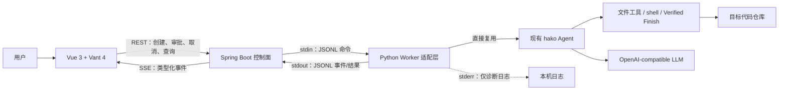
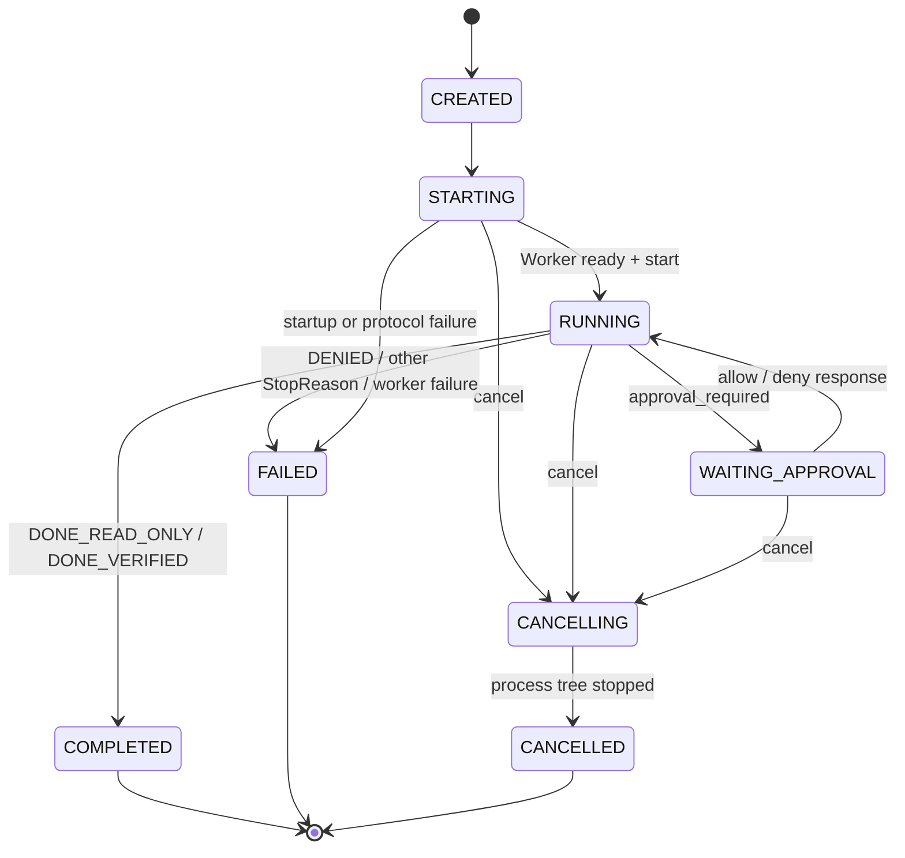

# hako Web 控制台需求规格（MVP）

> 文档版本：0.3｜日期：2026-08-28｜状态：前端、Spring Boot、真实/假 Worker 已实现；确定性端到端联调通过，真实模型 Web smoke 待手动执行
>
> 适用范围：在现有 hako CLI 之上新增 Vue 3 + Vant 4 + Spring Boot Web 控制台，不替换 Agent 内核。
>
> 接口细节见 [`WEB_CONSOLE_API.md`](./WEB_CONSOLE_API.md)，内核设计依据见 [`../DESIGN.md`](../DESIGN.md)。

## 1. 产品定义

hako 是一个通用 Coding Agent，可以在已有或空白代码仓库中完成 Bug 修复、小型功能开发、局部重构与补充测试；它重点增强多轮代码修改中的状态一致性、修改可控性和完成可信度。Web 控制台是 hako 的可视化控制面：用户提交仓库任务，观察“调查 → 修改 → 验证”的证据链，在副作用发生前审批，并在结束后拿到结构化工程摘要。

本次 MVP 的一句话目标是：**让一个不了解 hako 内部代码的人，也能在浏览器中安全地启动一次任务，并看懂 Agent 做了什么、为什么停下、修改了哪些文件、验证是否可信。**

### 1.1 目标

- 保留现有 Python `Agent`、工具、Verified Finish 和 CLI 行为，Web 与 CLI 复用同一套内核。
- 把现有类型化事件转换成实时任务时间线，不解析 Rich 终端文本。
- 写文件、编辑文件和执行命令前由浏览器明确批准；高风险操作不能被“本会话允许”绕过。
- 任务结束后展示停止原因、最终说明、变更路径和修改后验证证据，不把模型自述当作成功证明。
- 用假 Worker 完成稳定的前后端测试，再接入真实 hako，避免 CI 调用付费模型。

### 1.2 非目标

MVP 不做在线 IDE、代码文件树、GitHub 登录、Git 提交/推送、多人协作、账号权限、数据库、任务并发、远程服务器执行、模型供应商配置页面，也不在 Spring Boot 中重新实现 Agent 循环。Web 页面不接触 API Key。

## 2. 用户与核心场景

主要用户是本机运行 hako 的开发者或答辩演示者。典型流程如下：用户选择一个已存在的隔离仓库，输入 Issue 或工程任务；Agent 读取源码和日志，浏览器实时显示其调查过程；Agent 请求编辑或执行测试时，页面展示操作对象、参数和风险等级；用户允许后继续；最终页面把修改文件、测试命令、测试结论和停止原因收束成一张摘要卡。

核心成功场景只要求一项任务完整闭环，不要求多任务管理：

```text
输入 workspace + 工程任务
          ↓
Agent 调查（list/read）
          ↓
浏览器批准 edit/write/run_command
          ↓
Agent 修改并执行 targeted/full test
          ↓
Verified Finish 判断
          ↓
结构化工程摘要
```

## 3. 系统边界与架构



职责必须保持单向：Vue 只负责交互和展示；Spring Boot 管理 HTTP、任务状态与 Worker 进程；Python Worker 只做协议适配；hako 仍是任务决策、权限判定、工具执行和结束判断的唯一事实来源。Spring 不得解析 TUI 输出、推断测试是否成功或自行修改仓库。

### 3.1 当前实现状态

| 层次 | 当前实现 | 剩余边界 |
|---|---|---|
| Agent 内核 | 同步循环、工具注册、路径边界、分级审批、Verified Finish、`RunResult` | 保持唯一内核，不为 Web 分叉 |
| 事件 | 12 类业务事件、显式 JSON 映射、Worker 连续序号、Spring SSE 统一序号 | 新增事件时必须同步更新协议映射与测试 |
| CLI | Rich inline transcript、终端审批、`-y`，原入口保持不变 | 无 Web 依赖 |
| Worker | 真实 Worker 复用 `EventBus`、审批回调与 `RunResult`；假 Worker 提供确定性联调 | 真实模型 Web smoke 需本地密钥，默认不进 CI |
| 后端 | Spring Boot REST/SSE、单任务状态机、审批校验、事件重放、进程树回收 | 不含数据库、认证和远程执行 |
| 前端 | Vue 3 + Vant 4 控制台，Mock/API 双模式；刷新可按 URL 中 `taskId` 恢复 | 不持久化任务；后端重启后不可恢复 |

## 4. 设计原则

1. **内核只有一份。** Web 通过 `EventBus.subscribe()` 和 `Agent(..., approve=...)` 接入，不复制 `loop.py` 的判断。
2. **协议先于界面。** 先用假 Worker 固定 JSONL、状态机和 SSE，再开发真实 Worker 与页面。
3. **默认拒绝副作用。** Web 不使用 CLI 的 `-y`；只读工具直接执行，普通副作用等待审批，高风险副作用只能逐次批准。
4. **证据与结论分离。** 模型的文字是解释；`ToolResult`、退出码、`VerificationEvidence` 和 `StopReason` 才决定界面上的成功状态。
5. **本地优先。** MVP 默认只监听 `127.0.0.1`，任务与事件只保存在内存；服务重启后不承诺恢复。
6. **一次只做一件事。** 同一后端最多运行一个任务，先把演示路径做稳，再考虑并发。

## 5. 功能需求

优先级定义：P0 是 MVP 验收必需，P1 是演示增强但不阻塞首版，P2 明确后置。

| 编号 | 优先级 | 需求与验收口径 |
|---|---:|---|
| FR-001 | P0 | 用户可输入绝对 workspace 路径、任务描述和 `maxSteps`。提交前前后端都校验：路径存在、是目录、解析后位于后端允许根目录内；任务去空格后为 1–20,000 字符；`maxSteps` 为 1–100，默认 40。 |
| FR-002 | P0 | 创建任务后立即得到唯一 `taskId`，后端启动独立 Python Worker。已有活动任务时返回冲突，不排队、不并发。 |
| FR-003 | P0 | 页面按顺序显示运行开始、轮次、模型文本、工具开始/结束、上下文占用、验证提醒、截断续跑、subagent、不可恢复错误与运行结束事件。工具详情默认折叠，失败事件自动展开。 |
| FR-004 | P0 | `edit_file`、`write_file`、`run_command` 等 `needs_approval=True` 的调用在执行前暂停。审批卡至少展示工具名、参数预览、风险等级和危险原因；可选择允许一次、允许本会话同类普通工具或拒绝。高风险调用只允许“允许一次/拒绝”。 |
| FR-005 | P0 | 用户拒绝后，Worker 将 `False` 返回现有审批回调，Agent 以 `DENIED` 结束；界面不得偷偷重试或改成允许。浏览器断开时不得自动批准，任务保持等待。 |
| FR-006 | P0 | 用户可取消 STARTING、RUNNING 或 WAITING_APPROVAL 状态的任务。后端结束整个 Worker 进程树，最终状态为 CANCELLED；取消不等于回滚已经发生的文件修改，界面必须提示这一事实。 |
| FR-007 | P0 | 正常结束后展示 `RunResult`：成功布尔值、`StopReason`、步数、总 token、最终文本、变更路径和全部修改后验证证据。只有 `DONE_READ_ONLY` 与 `DONE_VERIFIED` 显示为成功。 |
| FR-008 | P0 | Worker 无法启动、协议行非法、进程意外退出或输出越限时，后端把任务置为 FAILED，保留可向用户说明的错误码；错误中不得包含 API Key。 |
| FR-009 | P0 | SSE 短暂断开时按浏览器自动携带的 `Last-Event-ID` 增量重放；完整刷新页面时先查询 Task，再从当前内存缓冲区起点重建时间线并继续订阅。不承诺服务重启后的恢复。 |
| FR-010 | P0 | Spring Boot 可通过确定性假 Worker 测试创建、事件顺序、审批、拒绝、取消、崩溃与结果映射；CI 不依赖真实模型和真实密钥。 |
| FR-011 | P0 | API Key、模型地址和模型名继续只由 Python 侧环境变量或仓库根目录 `.env` 读取；HTTP 请求、SSE、浏览器存储和 Spring 日志均不得出现密钥。 |
| FR-012 | P1 | 摘要页可把“修改前失败验证”和“修改后成功验证”并列；如果没有修改前证据，必须显示“未记录 baseline”，不得补造对比。该能力需要内核先提供结构化 pre-change evidence。 |
| FR-013 | P1 | 变更文件支持只读 diff 展示，但 diff 由独立边界组件生成，不从模型文字解析；大文件和二进制文件只显示元数据。 |
| FR-014 | P2 | 多任务历史、持久化、用户系统、远程 Agent、GitHub Issue/PR 联动和任务并发另立版本，不进入 MVP。 |

## 6. 任务状态机

任务状态表示 Web 运行态，`StopReason` 表示 Agent 为什么结束，两者不能混用。



状态转换只能由后端任务服务执行；前端只能发出意图。终态不可重新启动，重新执行必须创建新 `taskId`。

## 7. 页面需求

MVP 采用单页工作台，桌面演示优先，窄屏保持可读。Vue 3 使用 TypeScript 与 Composition API，Vant 4 提供表单、按钮、弹窗、标签、进度和折叠面板；时间线和代码块可用轻量自定义组件，不引入完整在线编辑器。

页面分为四个区域：顶部显示后端连通性、任务状态、当前模型和上下文用量；左侧或顶部表单填写 workspace、任务和最大步数；主体按事件顺序显示 Agent 文本与工具卡；底部或侧栏显示审批弹窗、取消按钮和最终摘要。终态后运行按钮恢复可用，但旧任务只读保留至创建下一任务或后端清理。

关键展示规则：

- `assistant_text` 明确标为“Agent 说明”，不能显示成系统验证结论。
- `tool_call_finished.ok=false` 使用错误色并默认展开；成功工具只显示摘要与耗时。
- `verification_required` 与 `continuation_required` 使用系统提醒样式，说明是内核拒绝草率结束，而不是模型自我纠错。
- `run_finished` 后再以 Worker 返回的完整 `RunResult` 渲染摘要；二者不一致时按协议错误处理，不静默选择一个。
- 危险审批卡必须完整展示 `dangerReason`；长参数可折叠，但确认按钮附近必须重复标注风险等级。

## 8. 审批与安全边界

审批权威仍在 Python Worker：它依据真实 `Tool.needs_approval` 和 `Tool.danger_reason(args)` 生成请求，Spring 与 Vue 不自行猜测危险性。普通工具的“允许本会话”只在当前 Worker 内按工具名记忆，任务结束即失效；高风险请求忽略任何会话记忆。等待审批时，同一任务只能存在一个未决 `approvalId`，过期、重复或跨任务响应必须拒绝。

后端必须满足以下边界：默认绑定 `127.0.0.1`；生产形态由 Spring 同源托管前端静态文件；开发态 CORS 仅放行显式配置的本机 Vite 地址；workspace 使用真实路径比较而不是字符串前缀；不把原始工具详情写入常规访问日志；错误日志做密钥模式脱敏；启动 Worker 使用 argv 数组而非拼接 shell 字符串。

需要明确告知用户：路径沙箱限制的是 hako 文件工具；`run_command` 仍是本机进程能力，审批和危险模式识别不是完整操作系统沙箱。取消任务也不会自动撤销已写入的文件。

## 9. 非功能需求

| 编号 | 约束 |
|---|---|
| NFR-001 可观测性 | 从后端收到 Worker 行到 SSE 发出，正常本机条件下 P95 小于 500 ms；每条事件带 `taskId`、单调序号和时间戳。 |
| NFR-002 顺序性 | Worker 来源消息严格按 `sequence` 校验，重复、跳号或倒序均视为协议错误；Spring 再为全部 HAKO/WORKER/WEB 事件统一分配单调 SSE `eventId`。 |
| NFR-003 有界内存 | 每任务最多缓存 2,000 条或 10 MiB 事件，以先到者为准；超限时保留状态/审批/终态事件并明确发出截断通知。 |
| NFR-004 编码 | REST、SSE、JSONL 和进程环境统一 UTF-8，必须通过 Windows 中文路径与中文任务测试。 |
| NFR-005 进程清理 | 正常结束、取消、后端关闭和异常退出均回收 Worker；取消时先请求终止，5 秒后仍存活则强制结束进程树。 |
| NFR-006 兼容性 | 首版支持 Windows 11；协议与业务代码不绑定 PowerShell，CI 继续覆盖 Windows 与 Ubuntu。 |
| NFR-007 可测试性 | 后端和前端核心流程可用假 Worker 完成，不依赖网络、LLM 随机性或真实 API Key。 |
| NFR-008 可访问性 | 状态不能只靠颜色表达；审批、取消和折叠组件支持键盘；正文与代码区域保持可读对比度。 |

## 10. 验收场景

1. **完整修改闭环：** 在临时仓库启动任务，依次收到 read、edit 审批、pytest 审批和结束事件；允许后只修改目标文件，摘要为 `DONE_VERIFIED`，列出变更路径与验证命令。
2. **只读完成：** Agent 只调查不修改，结束为 `DONE_READ_ONLY`，摘要成功且验证列表为空，页面不伪称“测试已通过”。
3. **缺少验证：** Agent 修改后试图直接结束，时间线出现 `verification_required`；再次不验证则任务 FAILED，停止原因 `DONE_UNVERIFIED`。
4. **普通拒绝：** 用户拒绝编辑，工具没有执行，任务 FAILED，停止原因 `DENIED`。
5. **高风险审批：** 即使此前选择“本会话允许 run_command”，命中危险规则的命令仍单独弹窗且不能选择会话放行。
6. **断线恢复：** 短暂断线时按 `Last-Event-ID` 增量重放；完整刷新时 GET Task 后重放当前缓冲区。两种情况均不乱序、不重复展示，新事件继续到达。
7. **取消：** 在运行中或等待审批时取消，Worker 进程树退出，状态为 CANCELLED，页面提示已有修改未自动回滚。
8. **异常：** 假 Worker 输出非法 JSON 或提前退出，任务为 FAILED，页面得到稳定错误码，后端仍可创建下一任务。
9. **中文环境：** workspace 含中文路径，任务和模型文本含中文，REST/SSE/JSONL 无乱码。
10. **密钥检查：** 浏览器网络记录、前端构建产物、Spring 日志和公开 Git 变更中均没有真实密钥。

## 11. 推荐仓库结构

```text
coding-agent/
├─ hako/                       # 已有 Python Agent 内核，不因 Web 分叉
├─ main.py                     # 已有 CLI，继续可独立运行
├─ docs/
│  ├─ WEB_CONSOLE_REQUIREMENTS.md
│  └─ WEB_CONSOLE_API.md
├─ web/
│  ├─ protocol/                # JSON Schema、示例与协议测试向量
│  ├─ worker/                  # Python EventBus/approval/RunResult 适配
│  ├─ backend/                 # Spring Boot REST/SSE 与进程管理
│  └─ frontend/                # Vue 3 + TypeScript + Vite + Vant 4
└─ scripts/
   └─ dev-web.ps1              # 本地联调入口，不承载业务逻辑
```

最终展示用目标仓库与 hako 仓库分离；开发期可放在已忽略的 `tmp/web-demo-targets/`，不得把商用项目名称、生产源码、真实日志或密钥复制进公开仓库。

## 12. 实施顺序与完成定义

实现顺序固定为：协议样例与假 Worker → Spring 状态机/进程管理/SSE → Python 真实 Worker → Vue 工作台 → 临时仓库端到端演示。任何阶段都不能靠解析 Rich 文本“先跑起来”。

当前代码与确定性联调已经满足：CLI 原测试通过；假 Worker 覆盖完整成功、拒绝、取消、越权审批和协议错误；浏览器实际完成 REST/SSE、两次审批、刷新恢复与 Verified Finish 摘要；公开变更通过密钥扫描。提交前仍应使用本地密钥让真实 Worker 在隔离小仓库完成一次 `read → edit → test → DONE_VERIFIED`，该 smoke 不进 CI，也不能用假 Worker 的结果冒充真实模型结果。P1 的 baseline 对比和 diff 不影响 MVP 完成判定。

## 13. 已知取舍

- 每任务一个 Worker 进程增加启动开销，但换来环境、审批等待和取消的清晰隔离，适合单用户本地产品。
- SSE 只解决服务端到浏览器的单向实时事件，审批仍走 REST；这比 WebSocket 简单，也符合当前顺序 Agent。
- 内存任务态降低实现量和泄露面，代价是后端重启后历史消失；MVP 接受这一代价。
- Vant 偏移动端组件，工作台的桌面时间线需要自定义布局；首版重视流程可读性，不追求 IDE 密度。
- 当前 `RunResult` 只有修改后验证证据，因此首版能诚实说明“改了什么、如何验证”，不能在没有内核数据时声称自动完成严格 Before/After 性能对比。

## 14. 术语说明

本文的 **SSE** 指浏览器接收实时事件的 Server-Sent Events 传输协议；它与本地评测中的“SSE 流式解析 Bug 场景”只是同名技术概念，不是同一模块。**Verified Finish** 指修改后必须存在新的成功测试、构建或静态检查证据；它不等于独立 hidden tests，也不证明业务目标一定正确。**Worker** 指把 Spring 请求适配到现有 Python Agent 的薄进程，不是第二套 Agent。
